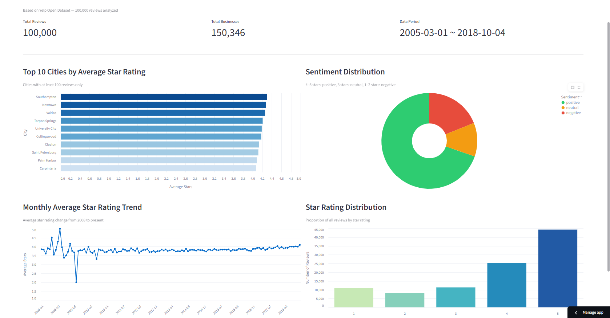
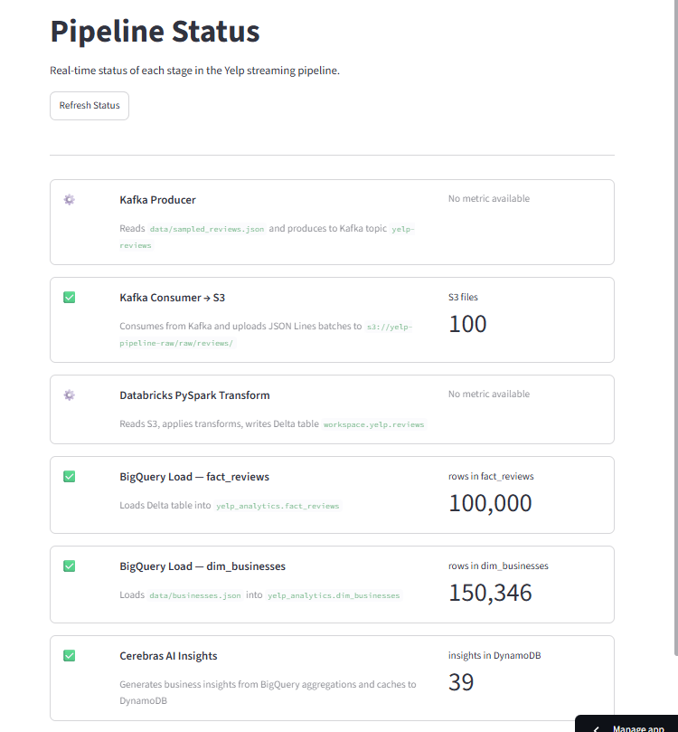
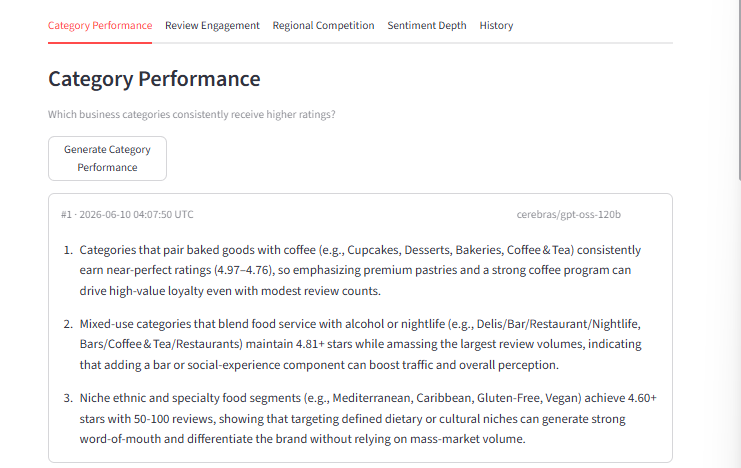
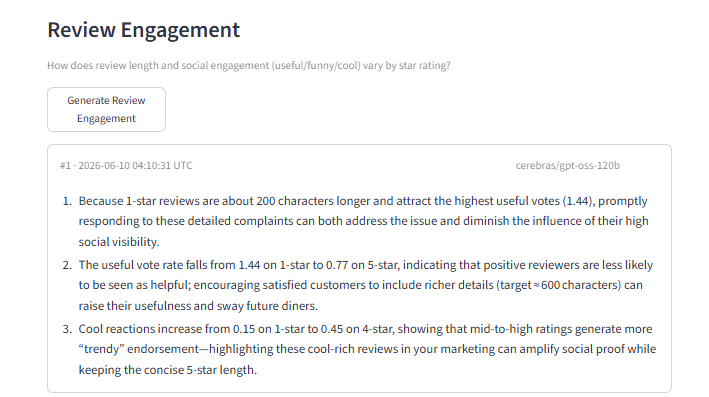
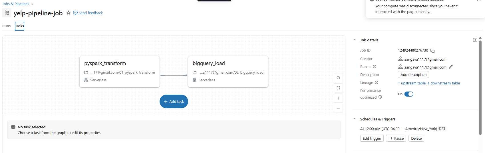

# Yelp Streaming Analytics Pipeline

A end-to-end streaming data pipeline that ingests 100,000 Yelp reviews, transforms them through a multi-stage cloud architecture, and surfaces business insights via an AI-powered dashboard.

**[Live Demo →](https://yelpnjimin.streamlit.app/)**

---

## Screenshots

| Overview Dashboard | Pipeline Status |
|---|---|
|  |  |

| AI Insights — Category Performance | AI Insights — Review Engagement |
|---|---|
|  |  |

| Databricks Job DAG |
|---|
|  |

---

## Architecture

```
┌─────────────────────────────────────────────────────────────────┐
│                        DATA SOURCES                             │
│              Yelp Open Dataset (JSON, 100K reviews)             │
└──────────────────────────┬──────────────────────────────────────┘
                           │
                           ▼
┌──────────────────────────────────────────────────────────────────┐
│                     INGESTION LAYER                              │
│                                                                  │
│   producer.py  ──►  Apache Kafka (yelp-reviews topic)           │
│                      partitioned by business_id                  │
│                           │                                      │
│                           ▼                                      │
│   consumer.py  ──►  AWS S3  (s3://yelp-pipeline-raw/)           │
│                      batched JSON Lines, date-partitioned        │
└──────────────────────────┬───────────────────────────────────────┘
                           │
                           ▼
┌──────────────────────────────────────────────────────────────────┐
│                   TRANSFORMATION LAYER                           │
│                                                                  │
│   Databricks PySpark                                             │
│     • Null filtering & deduplication (review_id)                │
│     • Feature engineering: sentiment_bucket, review_length,     │
│       year_month                                                 │
│     • Write to Delta Lake (partitioned by year_month)           │
└──────────────────────────┬───────────────────────────────────────┘
                           │
                           ▼
┌──────────────────────────────────────────────────────────────────┐
│                      SERVING LAYER                               │
│                                                                  │
│   BigQuery                                                       │
│     • fact_reviews      (100,000 rows, partitioned by date)     │
│     • dim_businesses    (150,346 rows)                           │
│                                                                  │
│   DynamoDB  ──  AI insight cache (TTL-based)                    │
└──────────────────────────┬───────────────────────────────────────┘
                           │
                           ▼
┌──────────────────────────────────────────────────────────────────┐
│                    PRESENTATION LAYER                            │
│                                                                  │
│   Streamlit dashboard                                            │
│     • Overview  (Altair charts)                                 │
│     • Pipeline Status                                           │
│     • AI Insights  (Cerebras gpt-oss-120b → DynamoDB cache)    │
└──────────────────────────────────────────────────────────────────┘
```

---

## Tech Stack

| Layer | Technology | Purpose |
|---|---|---|
| Ingestion | Apache Kafka | Streaming message queue |
| Storage (raw) | AWS S3 | Raw JSON Lines landing zone |
| Transformation | Databricks + PySpark | Distributed data processing |
| Storage (curated) | Delta Lake | ACID-compliant columnar storage |
| Warehouse | Google BigQuery | Analytical query engine |
| AI Inference | Cerebras gpt-oss-120b | Business insight generation |
| Cache | AWS DynamoDB | AI insight persistence |
| Dashboard | Streamlit + Altair | Interactive visualization |

---

## Data Flow

1. **Sample** — `ingestion/sample_data.py` draws 100K reviews from the Yelp Open Dataset and writes `data/sampled_reviews.json`.
2. **Produce** — `ingestion/producer.py` streams records into Kafka at a configurable rate (default 100 msg/s), keyed by `business_id`.
3. **Consume** — `ingestion/consumer.py` batches 1,000 messages and uploads each batch as a timestamped JSON Lines file to S3.
4. **Transform** — Databricks notebook `01_pyspark_transform.py` reads all S3 files, applies null filtering, deduplication, and feature engineering, then writes a Delta table partitioned by `year_month`.
5. **Load** — `02_bigquery_load.py` loads the Delta table into BigQuery `fact_reviews` and loads business metadata into `dim_businesses`.
6. **Analyze** — Streamlit queries BigQuery on demand; AI insights are generated via Cerebras API and cached in DynamoDB.

---

## Key Technical Decisions

### 1. Kafka Partitioning by `business_id`
All reviews for the same business land on the same partition. This guarantees ordering per business and enables future stateful aggregations (e.g., rolling average stars) without cross-partition shuffles.

### 2. Delta Lake as Intermediate Storage
Writing PySpark output to Delta before loading to BigQuery provides ACID transactions, schema enforcement, and time-travel. Deduplication on `review_id` is idempotent on re-runs — safe to re-execute without double-counting.

### 3. BigQuery Partitioning by `date`
`fact_reviews` is partitioned on the `date` column. Time-range queries (monthly trend, recent reviews) scan only the relevant partitions, reducing both query latency and cost at scale.

---

## Project Structure

```
yelp-streaming-pipeline/
├── ingestion/
│   ├── producer.py          # Kafka producer (streams sampled reviews)
│   ├── consumer.py          # Kafka consumer → S3 uploader
│   └── sample_data.py       # Samples N reviews from raw dataset
├── databricks/
│   └── notebooks/
│       ├── 01_pyspark_transform.py   # S3 → Delta Lake
│       └── 02_bigquery_load.py       # Delta → BigQuery
├── bigquery/
│   └── load_businesses.py   # Loads dim_businesses
├── s3/
│   ├── s3_uploader.py
│   └── s3_downloader.py
├── ai_insights/
│   └── insight_generator.py # Cerebras API → DynamoDB
├── dynamodb/
│   └── cache_manager.py     # DynamoDB read/write helpers
├── streamlit/
│   ├── app.py
│   ├── components/
│   │   └── sidebar.py
│   └── pages/
│       ├── overview.py      # Analytics dashboard
│       ├── pipeline.py      # Pipeline status monitor
│       └── insights.py      # AI insights viewer
├── images/                  # Dashboard screenshots
├── .env.example
└── requirements.txt
```

---

## Quick Start

### Prerequisites
- Python 3.9+
- Apache Kafka running locally (`localhost:9092`)
- AWS credentials with S3 and DynamoDB access
- GCP service account with BigQuery access
- Yelp Open Dataset JSON files

### 1. Install dependencies

```bash
pip install -r requirements.txt
```

### 2. Configure environment

```bash
cp .env.example .env
# Edit .env — see Environment Variables below
```

### 3. Sample the dataset

```bash
python ingestion/sample_data.py
```

### 4. Start the pipeline

```bash
# Terminal 1 — start consumer
python ingestion/consumer.py --batch-size 1000 --timeout 60

# Terminal 2 — start producer
python ingestion/producer.py --rate 100
```

### 5. Transform & load (Databricks)

Run the notebooks in order in your Databricks workspace:
1. `databricks/notebooks/01_pyspark_transform.py`
2. `databricks/notebooks/02_bigquery_load.py`

### 6. Launch the dashboard

```bash
streamlit run streamlit/app.py
```

---

## Environment Variables

Copy `.env.example` to `.env` and fill in the values:

```env
# Yelp dataset paths
YELP_DATASET_PATH=/path/to/yelp_academic_dataset_review.json
YELP_BUSINESS_PATH=/path/to/yelp_academic_dataset_business.json
SAMPLE_SIZE=100000

# Kafka
KAFKA_BOOTSTRAP_SERVERS=localhost:9092
KAFKA_TOPIC_REVIEWS=yelp-reviews

# AWS
AWS_ACCESS_KEY_ID=your_key
AWS_SECRET_ACCESS_KEY=your_secret
AWS_REGION=us-east-1
S3_BUCKET_RAW=yelp-pipeline-raw
S3_PREFIX=raw/reviews/

# GCP / BigQuery
BQ_PROJECT_ID=your_gcp_project
GCP_SERVICE_ACCOUNT_JSON=/path/to/service-account.json
# or paste JSON contents directly for cloud deployment

# DynamoDB
DYNAMODB_TABLE=your_dynamodb_table_name

# Cerebras
CEREBRAS_API_KEY=your_cerebras_api_key
```
